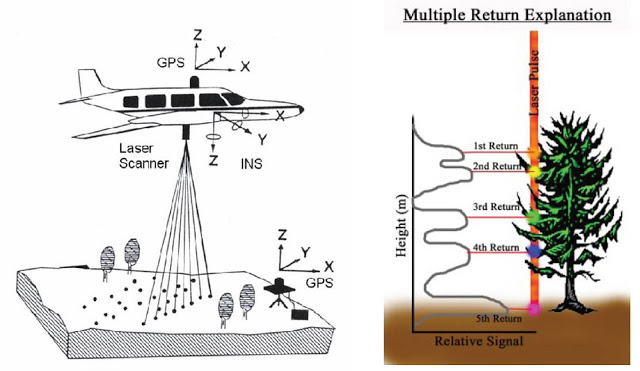
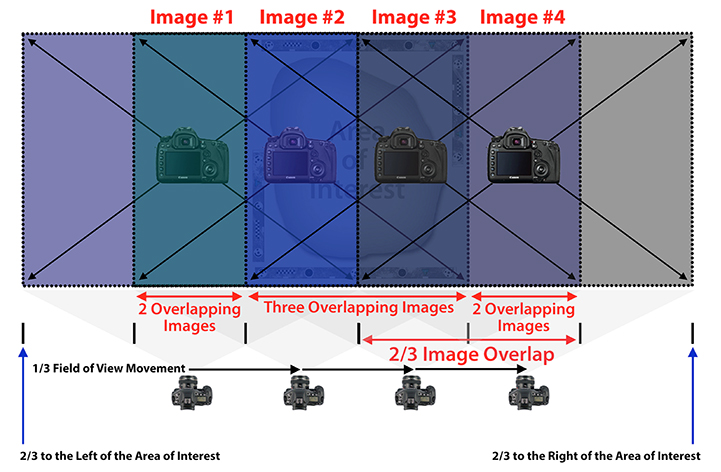
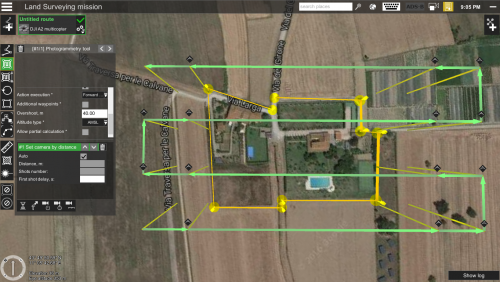
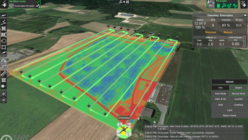
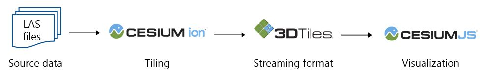

# Point Cloud Visualization
Bryan Begay and Katie Nicolato  **|**  GEOG 572 Geovisual Analytics  **|**  Spring 2019

Visualized point cloud example from the Potree website.

## Objectives

* Understanding point cloud geovisualization
* LiDAR basics
* Structure from Motion basics
* Unmanned Aerial Systems overview
* Potree and 3DF Zephyr data processing

## Overview of .las files, LiDAR, and Structure from Motion (SfM)

LAS datasets and LAS files are an industry standard binary format that allows LiDAR and Structure from Motion (SfM) data aquisitions to be stored quickly and easily. The LAS files contain point clouds, which are large numbers of discrete data points in space. Each point contains XYZ coordinates with intensity associated RGB color values. 3-D scanners, LiDAR, and SfM generate point clouds stored in LAS files.

Detailed point clouds are captured with active sensors such as LiDAR, or with passive remote sensing techniques from a high resolution multispectral camera (e.g. SfM). Active sensors generate their own energy to record data (e.g. laser pulses), and passive sensors gather imagery from passive energy sources (e.g. light reflecting off of objects and sensed in a camera lens).

LiDAR data is stored inherently in LAS files as point data, but SfM requires software and overlapping images to create LAS datasets with mathematical models and computer software generating points in space. Careful data collection and sufficient preprocessing generates a high quality dataset for use in analyses. Visualizing point cloud datasets is a fundamental step in understanding the datasets and using point clouds as a tool for education or visual aid.

  LiDAR example from Zachary Fancher (2012).  

  Structure from Motion example from the Cultural Heritage Imaging website.

## Unmanned Aerial Systems Overview

Unmanned Aerial Systems have emerged as a preferred platform for point cloud data acquisition across disciplines. Users can affix a high resolution camera or LiDAR instrument to a UAS. They can use mission planning software to program an automated flight path with customized parameters like altitude, speed, and camera settings. The user will program a snake-like or gridded flight path capturing one image every few seconds to achieve a high quality point cloud for an area of interest.

 
  UAS mission planning examples from the Universal Ground Control Software website.

Mission planning software is available for download. Some programs integrate flight planning and image processing into a comprehensive package:

[Universal Ground Control Software](https://www.ugcs.com/) 
[DroneDeploy](https://www.dronedeploy.com/) 
[DroneMapper](https://dronemapper.com/) 
[Pix4D](https://www.pix4d.com/) 

## Preprocessing

Before analyzing or visualizing a point cloud, clean and package the acquired data to minimize error and corruption. Open source point cloud visualization and editing software are available for download:

[CloudCompare](https://www.danielgm.net/cc/) (All-around visualization) 
[Fusion](http://forsys.cfr.washington.edu/fusion/fusionlatest.html) (Forestry) 
[lidR](https://github.com/Jean-Romain/lidR) (R Package for Forestry) 
[LAStools](https://rapidlasso.com/lastools/) (Editing and Analyses) 

**LAS Format**

Ensure lidar and SfM are prepared in the correct .las format. Use open source software such as CloudCompare or Fusion to visualize the .las point cloud.

**Merge**

Users may acquire point cloud data in separate files. Use a merge command or tool in the suggested software or ArcGIS to combine .las files in preparation for clipping and analyses.

**Clip**

Users may have an area of interest, such as a polygon shapefile, for clipping a .las dataset. After merging, use a clip command or tool in the suggested software or ArcGIS to clip a .las file to a polygon of interest.

**Normalize**

Some applications require "absolute" z-values devoid of elevation influence. For instance, to achieve absolute tree height, we subtract the ground elevation from the surface height (Digital Surface Model - Digital Elevation Model). This produces tree height from the ground to the canopy maxima and does not include elevation from sea level. The visualization result is a "flat" point cloud lacking terrain features.

Pre-Normalizing a forest stand

Post-Normalizing a forest stand

## Processing Structure from Motion Data

Users can process SfM data with a variety of software. The process is generally the same on all platforms. The user manually identifies shared georeferenced photo points across the acquired dataset. The software then generates sparse and dense point clouds based on image positions, with options to create triangulated meshes from the point clouds.

[Agisoft Metashape](https://www.agisoft.com/) is an industry standard visualization software for SfM data. A free trial is available but full access requires payment.

[3DF Zephyr](https://www.3dflow.net/3df-zephyr-pro-3d-models-from-photos/) is an open source SfM visualization software. The free version allows users to take up to 50 photos for 3D model production. Photos can be acquired with a good quality cell phone camera.

## Web Visualization with Potree Converter

[Potree Converter](https://github.com/potree/PotreeConverter) transforms 3D point clouds into a web-friendly format for online visualization. The input file must be in .las format. The tool creates an HTML file with the associated point cloud and libraries for hosting on a web server. The resulting web page allows 360-degree viewing and zoom functions. The ouput Potree web page includes many tools for manipulating and measuring the target point cloud. Users can customize the page template through the source code.

**Conversion Code**

1. Create a Workspace folder to store all files in a single working directory.

2. Download Potree Converter into the folder.

3. Move target .las file into the folder.

4. Open Command Prompt and navigate to the folder.

5. Enter the code below, making the following substitutions:

> `PotreeConverter.exe G:\input.las -o G:\output -p index --overwrite --output-format LAS`

> *PotreeConverter.exe* = Full file path for the Potree Converter executable 
> *G:\input.las* = Full file path for the input .las file 
> *G:\output* = Full file path for the output location. The program will create a folder with this title to store the ouputs. 

6. If successful, you will receive this CMD output:

7. Check the output folder for files. It should contain a folder for libraries, the point cloud, and an index.html file. Rename the index.html file to a name that suits your application:

8. Potree requires a web server to host the point cloud visualization files. We will use GitHub as our web server.

**GitHub Hosting**

1. Create a GitHub repository to host the 3D geovisualization.

2. Extract the lib and point cloud folders and renamed index.html file from the output folder and push them to the repository with Atom or GitHub Desktop.

3. The visualization will appear at the repository address "/index.html" (or renamed HTML).

**Examples**

https://gimbalmonkey.github.io/pointcloudviz/Viewshed1.html
https://gimbalmonkey.github.io/pointcloudviz/oatcreek.html
https://gimbalmonkey.github.io/pointcloudviz/bakercreek.html

**Customizing Potree**

Users can customize the point cloud web page created with Potree Converter by exploring the source code. Users can add, remove, and manipulate the default visualization and measurement tools provided.

## Web Visualization with Cesium

[Cesium ion](https://cesium.com/cesium-ion/) is an alternative platform for point cloud visualization. Cesium ion provides integrated workflows for optimizing, customizing, and hosting geospatial data. Cesium ion allows base map integration for landscape visualization in addition to point clouds.

[Cesium Point Cloud Workflow](https://cesium.com/3d-tiling-pipeline/point-clouds/)

Below are necessary programs associated with Cesium point cloud visualization:

[Cesium Point Cloud Generator](https://github.com/tum-gis/cesium-point-cloud-generator) 
[3D Tiles](https://github.com/AnalyticalGraphicsInc/3d-tiles) 
[3D Tiles Styling](https://github.com/AnalyticalGraphicsInc/3d-tiles/tree/master/specification/Styling) 
[CesiumJS](https://github.com/AnalyticalGraphicsInc/cesium) is a JavaScript library integrating WebGL to create 2D and 3D web maps. CesiumJS will ultimately build the interface hosting the point cloud and base maps.

## Additional Resources

[Entwine](https://entwine.io/) and [PDAL](https://pdal.io/) are useful applications for organizing and packaging LAS data for web visualization.

[Plasio](https://github.com/verma/plasio) and [Greyhound](https://greyhound.io/index.html) are additional platforms for hosting and visualizing point cloud data.
